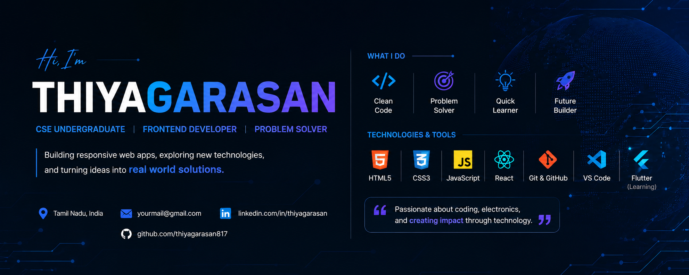

  

<h1 align="center">Hi 👋, I'm Thiyagarasan C</h1>

<h3 align="center">
Aspiring Full Stack Developer • Computer Science Student • Lifelong Learner
</h3>

---

## 👨‍💻 About Me

🎓 Computer Science Student

💻 Passionate about building modern web applications.

🌱 Currently learning

- React.js
- Java
- Data Structures & Algorithms
- Database Management System
- Git & GitHub

🎯 *Goal*

Become a skilled Full Stack Developer and contribute to impactful real-world software.

---

## 💻 Tech Stack

---

## 📚 Learning Progress

| Technology | Progress |
|------------|----------|
| HTML | ⭐⭐⭐⭐⭐ |
| CSS | ⭐⭐⭐⭐⭐ |
| JavaScript | ⭐⭐⭐⭐☆ |
| React | ⭐⭐☆☆☆ |
| Java | ⭐⭐☆☆☆ |
| DBMS | ⭐⭐☆☆☆ |
| DSA | ⭐⭐☆☆☆ |
| Git & GitHub | ⭐⭐⭐☆☆ |

---

## 🚀 Featured Projects

### 🌐 Personal Portfolio Website

Responsive portfolio built using *HTML & CSS*

🔗 Repository

https://github.com/thiyagarasan6380-alt/Portfolio

---

### ⚛️ React Learning Projects

Building projects while learning React fundamentals.

---

### ☕ Java Applications

Console-based Java programs demonstrating OOP concepts.

---

### 📚 DSA Practice

Problem-solving programs and implementations.

---

## 🏆 Certifications

🏅 IBM SkillsBuild

🏅 Coursera Certifications

🏅 More certifications coming soon...

---

## 🌐 Connect With Me

---

## 🎯 2026 Goals

- ✅ Master React
- ✅ Learn Node.js & Express
- ✅ Build 10+ Projects
- ✅ Improve DSA Skills
- ✅ Contribute to Open Source
- ✅ Secure a Software Development Internship

---

## 📈 GitHub

📌 My repositories document my learning journey through projects, experiments, and continuous improvement.

---

## 👀 Profile Views

---

## 💡 Favorite Quote

> *"The best way to learn programming is by building projects."*

---

<h2 align="center">

  Thanks for visiting my profile!

If you enjoy my work, consider giving my repositories a .

Happy Coding! 🚀

</h2>
